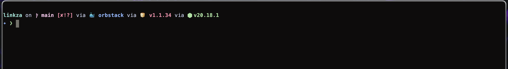
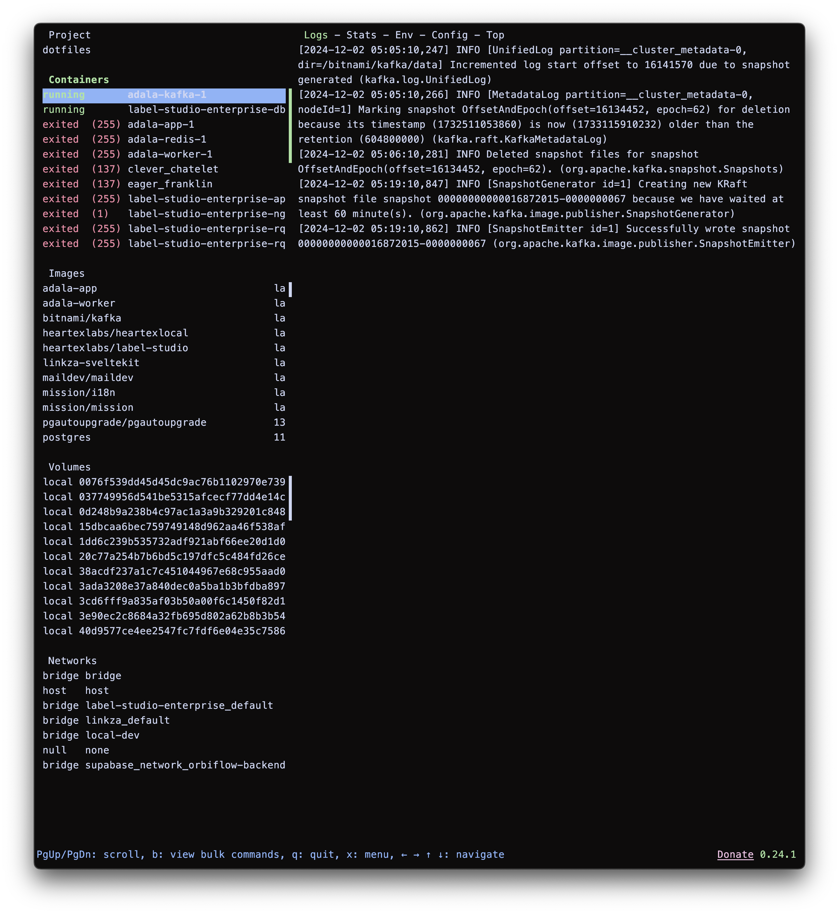
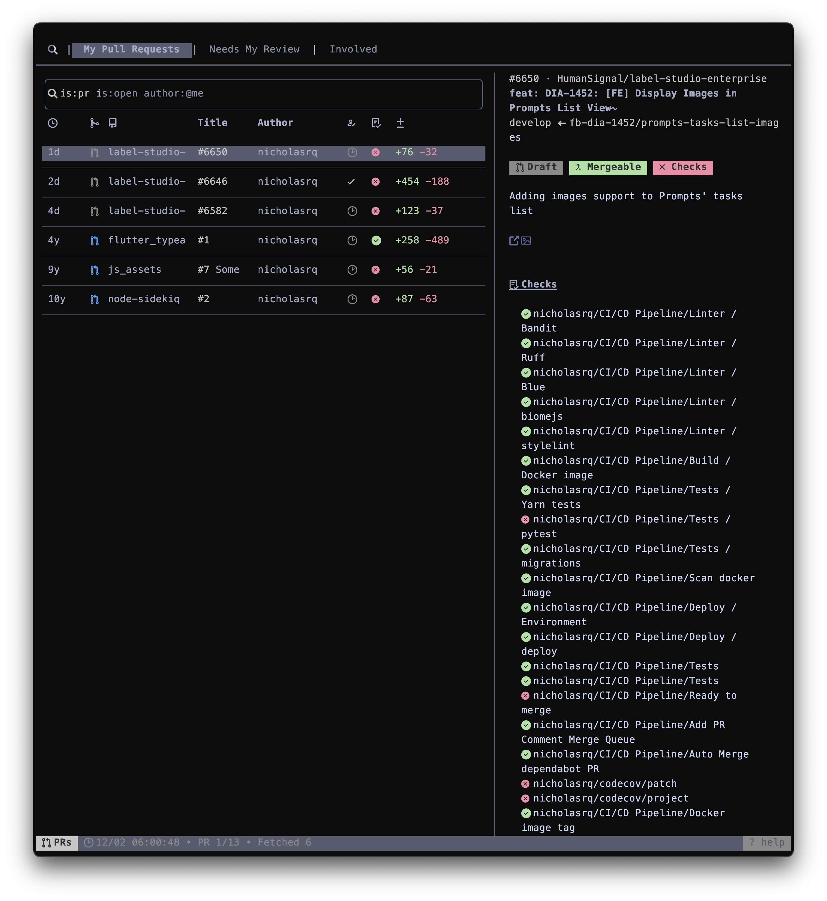

# My personal dotfiles collection

## What's included

This is a list of everything that I use daily or somewhat often. Some of the apps on this list run in background or launched on system start.

### Terminal

I'm spending most of the time in the terminal, so this is the most tailored place of them all.

  

    
  

  

    <h3>Kitty</h3>
    GPU accelerated terminal emulator. I used iTerm2, Alacritty, Wezterm and kitty. The last one turned out to be perfect for. More about kitty.
     
     
    <a href="https://sw.kovidgoyal.net/kitty/">Kitty</a>
  

  

    
  

  

    <h3>starship</h3>
    Starship is a customizable prompt for your shell. It can display various information like git status, current branch, current directory and even some environment info like your node or bun version
     
     
    <a href="https://starship.rs/" alt="Starship">Starship</a>
  

### CLIs and TUIs

  

    
  

  

    <h3>Neovim</h3>
    Terminal-based text editor, successor of Vim. Highly customizable, blazingly fast.
     
     
    <a href="https://neovim.io/" alt="Neovim">Neovim</a>
  

  

    
  

  

    <h3>Lazygit</h3>
    TUI for git operations.
     
     
    <a href="https://github.com/jesseduffield/lazygit" alt="lazygit">Lazygit</a>
  

  

    
  

  

    <h3>Yazi</h3>
    Advanced file manager with written in Rust. Has vim-inspired navigation.
     
     
    <a href="https://yazi-rs.github.io/" alt="Yazi">Yazi</a>
  

  

    
  

  

    <h3>Lazydocker</h3>
    Terminal-based Docker control panel.
     
     
    <a href="https://github.com/jesseduffield/lazydocker" alt="Yazi">Lazydocker</a>
  

  

    
  

  

    <h3>gh and gh-dash</h3>
    GitHub dashboard based on gh - official GitHub CLI.
     
     
    <a href="https://cli.github.com/" alt="gh">gh</a>
     
    <a href="https://github.com/dlvhdr/gh-dash" alt="gh-dash">gh dash</a>
  

  

    
  

  

    <h3>gh and gh-dash</h3>
    Process monitor. Better <code>top</code>
     
     
    <a href="https://github.com/aristocratos/btop" alt="btop">btop</a>
  

### UI and system navigation

#### Aerospace

#### Skethybar

#### Borders

### Misc

#### Hookdeck

#### Raycast

