<h1 align="center" style="font-family: monospace;">Dotfiles</h1>

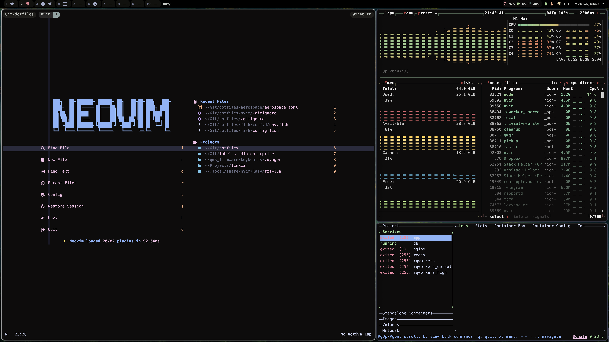

## What's included

This is a list of everything that I use daily or somewhat often. Some of the apps on this list run in background or launched on system start.
I've been tailoring my system for years. Now I'm finally at the point where I'm almost 100% satisfied with it.

#### Terminal of choice - Kitty

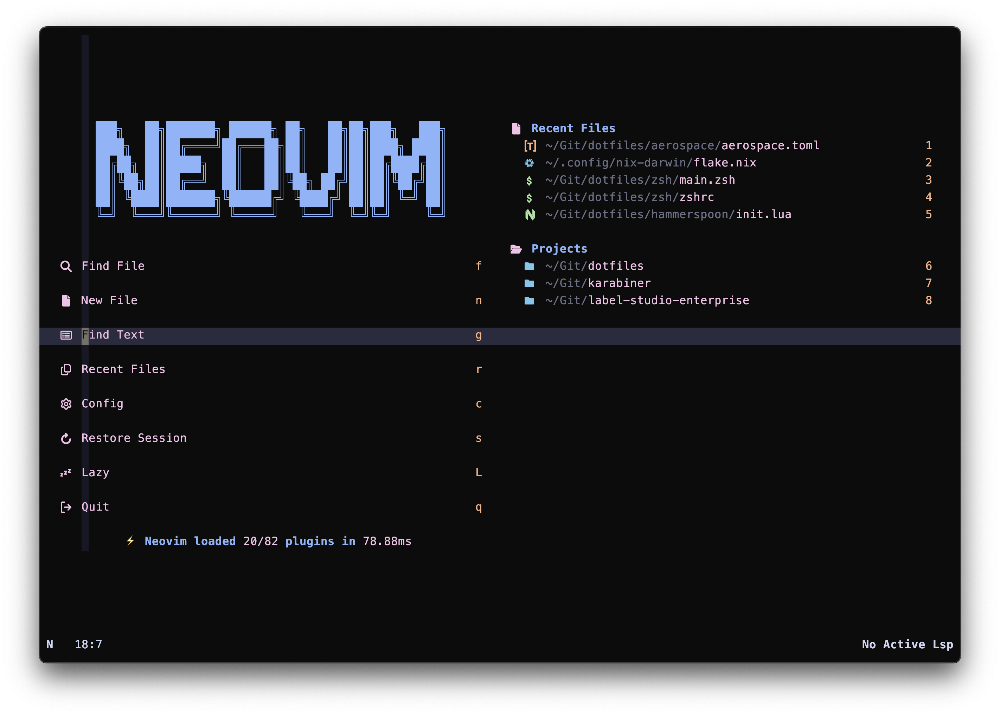
I'm spending most of the time in the terminal, so this is the most tailored place of them all.

GPU accelerated terminal emulator. I used iTerm2, Alacritty, Wezterm and kitty. The last one turned out to be perfect for. More about kitty.

[Kitty](https://sw.kovidgoyal.net/kitty/)

  

#### The best text editor of all time - Neovim

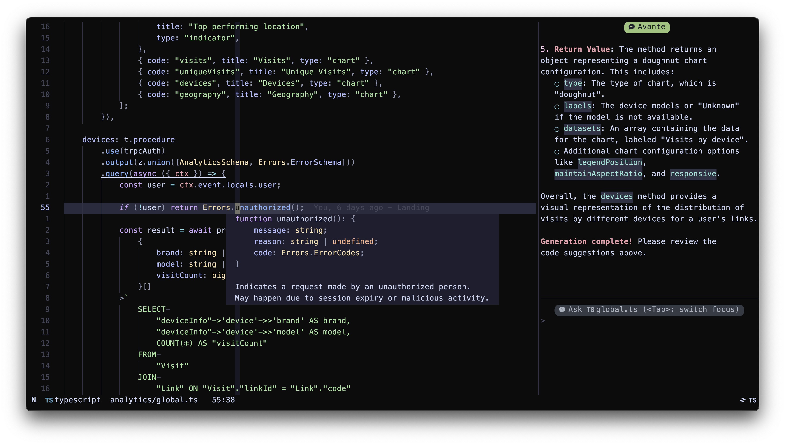
Terminal-based text editor, successor of Vim. Highly customizable, blazingly fast.

[Neovim](https://neovim.io/)

  

#### Better git experience - Lazygit

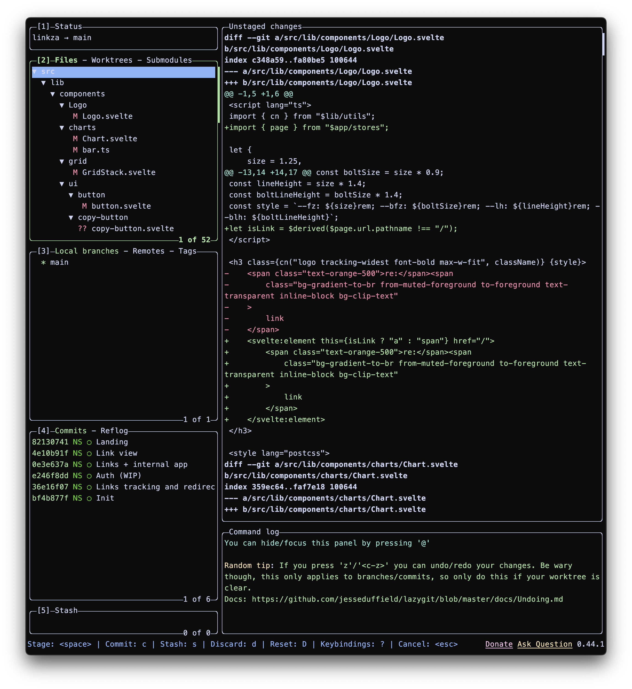
GIT UI for your terminal. Probably, the most used tool after Neovim.

[Lazygit](https://github.com/jesseduffield/lazygit)

  

#### Terminal file explorer that don't suck - Yazi

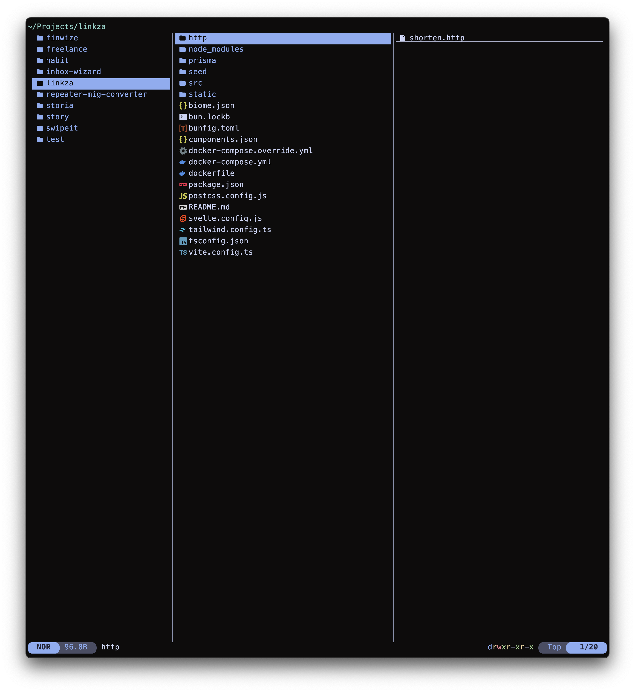

> Advanced file manager with written in Rust. Has vim-inspired navigation. Perfect when you need to perform certain operations
> without leaving your terminal.

[Yazi](https://yazi-rs.github.io/)

  

#### All issues, PRs and stuff in one place - gh & gh dash

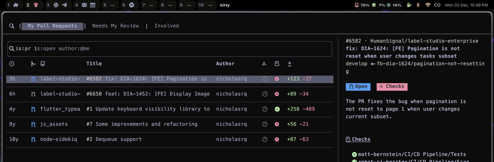

> GitHub dashboard based on `gh` - official GitHub CLI. No need to go to the browser to explore pull requests, issues and stuff.
> Integrates with `octo.nvim` to perform code reviews and more.

[gh](https://cli.github.com/) • [gh dash](https://github.com/dlvhdr/gh-dash)

  

#### Forget about the Activity Monitor - BTOP

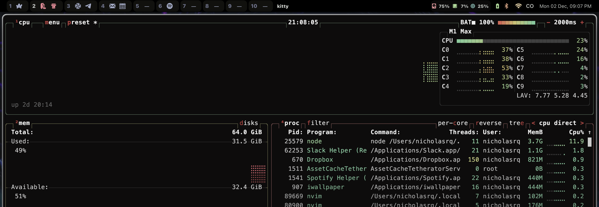

> Process monitor. Similar to `top` and `htop` but far better.

[BTOP](https://github.com/aristocratos/btop)

### UI and system navigation

#### For those who's missing i3 on mac - Aerospace

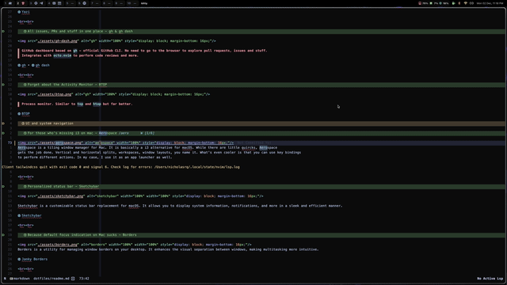
Aerospace is a tiling window manager for Mac. It is basically a i3 alternative for macOS. While there are little quircks, Aerospace
gets the job done. Vertical and horizontal splits, workspaces, window layouts, you name it. What's even cooler is that you can use key bindings
to perform different actions. In my case, I use it as an app launcher as well.

[Aerospace](https://github.com/FelixKratz/SketchyBar)

  

#### Personalized status bar - Sketchybar

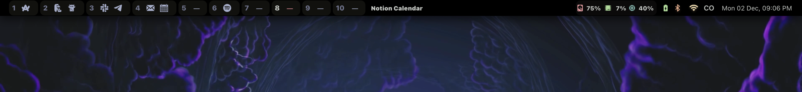

Sketchybar is a customizable status bar replacement for macOS. It allows you to display system information, notifications, and more in a sleek and efficient manner.

[Sketchybar](https://github.com/FelixKratz/SketchyBar)

  

#### Because default focus indication on Mac sucks - Borders

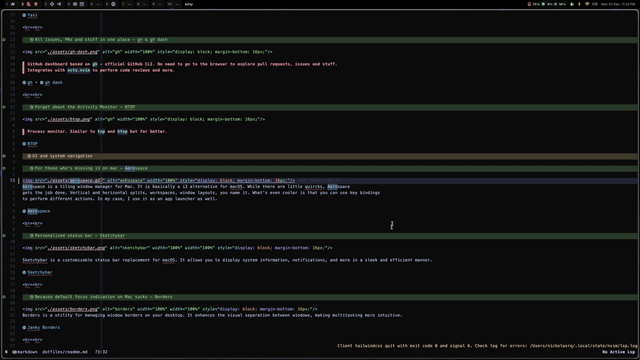
Borders is a utility for managing window borders on your desktop. It enhances the visual separation between windows, making multitasking more intuitive.

[Janky Borders](https://github.com/FelixKratz/JankyBorders)

  

#### Raycast

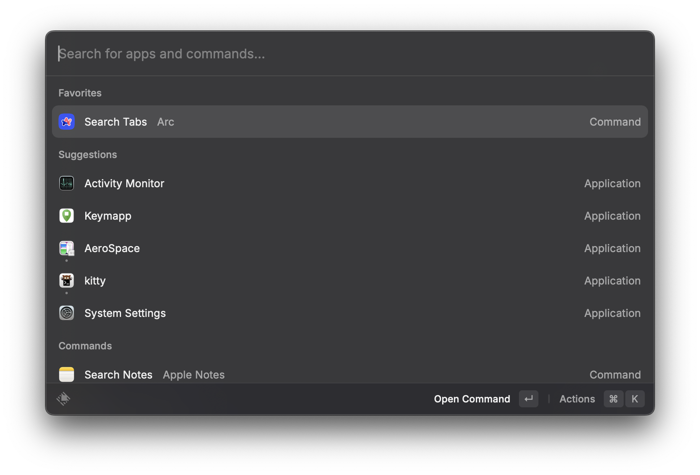
Raycast is a productivity tool that allows you to perform tasks quickly using keyboard shortcuts. It integrates with various applications to streamline your workflow.

[Raycast](https://www.raycast.com/)

### Utilities worth mentioning

- [fzf](https://github.com/junegunn/fzf) - Fuzzy finder. You can pipe pretty much any list of strings into it and search through.
- [zoxide](https://github.com/ajeetdsouza/zoxide) - Smarter `cd`. It remembers directories you visited and allow fuzzy `cd`. E.g., if I type `z dot` it will `cd ~/Git/dotfiles`
- [eza](https://github.com/eza-community/eza) - A drop-in replacement for `ls`. Supports tree view, icons, friendly formatting and more.
- [tmux](https://github.com/tmux/tmux) - TMUX allows you to spawn long-sessions that will continue working in the background even if you close your terminal

### My socials
[YouTube](https://www.youtube.com/@NSkriabinDev)
[Twitch](https://twitch.tv/nick_skriabeen)
[Telegram channel](https://t.me/nick_skriabeen)
[X (ex. Twitter)](https://x.com/nick_skriabin)
